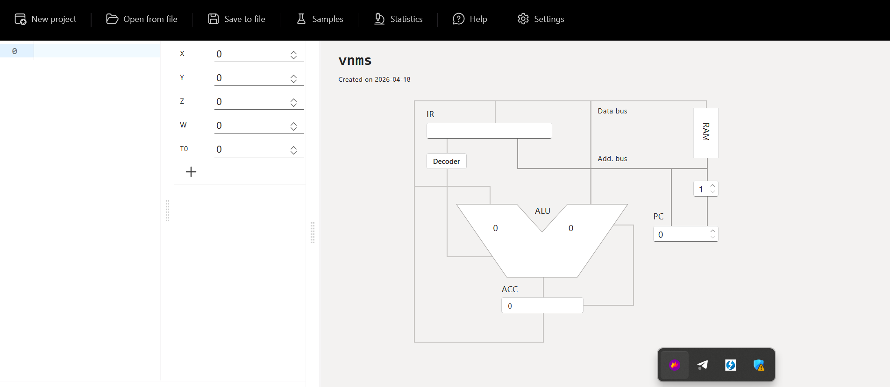

# Practical 2 - Von Neumann Machine

This folder now contains the two custom vnmsim programs requested by the assignment together with ready-to-open JSON scenarios for collecting screenshots.

Included files:

- `P1_EX3_initials.txt`: Exercise 3 program.
- `P1_EX5_initials.txt`: Exercise 4 program, saved with the filename requested by the assignment text.
- `P1_EX3_case_keep.json`: Example case where `X = 0`, so the values are not swapped.
- `P1_EX3_case_swap.json`: Example case where `X = 1`, so the values are swapped.
- `P1_EX5_case_total.json`: Example case where `X = 0`, so all ten values are added.
- `P1_EX5_case_first5.json`: Example case where `X = 1`, so only `T1..T5` are added.
- `P1_EX5_case_last5.json`: Example case where `X = 2`, so only `T6..T10` are added.

## Exercise 1 - Understanding the vnmsim Interface

Initial interface screenshot:



### Main elements visible in the simulator

| Interface element | Role in vnmsim | Von Neumann architecture meaning |
| --- | --- | --- |
| Top menu | Gives access to `New project`, `Open from file`, `Save to file`, `Samples`, `Statistics`, `Help`, and `Settings` | These controls do not belong to the theoretical machine itself; they are the environment used to load programs and inspect execution |
| RAM editor on the left | Text area where each memory line contains an instruction or numeric cell | Represents main memory, where program instructions and data live in the same address space |
| Variable table (`X`, `Y`, `Z`, `W`, `T0/T1...`) | Editable values used by the current program | Represents data stored in RAM cells; `T` variables are temporary memory locations |
| Add `T` variable button | Creates more temporary variables | Extends the available memory cells for intermediate storage |
| IR (Instruction Register) | Shows the current decoded instruction and operand | Holds the instruction currently being executed |
| Decoder | Indicates the control unit stage that interprets the current instruction | Represents the control unit that decides how hardware reacts to the opcode |
| ALU | Shows the arithmetic operation and operands currently in use | Executes arithmetic and logic operations |
| ACC (Accumulator) | Stores the current working value | Central working register used by this machine for arithmetic |
| PC (Program Counter) | Shows the address of the next instruction | Points to the next memory location to fetch |
| Data bus | Visual connection between memory, IR, ALU, and ACC | Carries data and instructions between components |
| Address bus | Visual connection used with the PC and RAM | Carries memory addresses |
| RAM block on the diagram | Abstract diagrammatic memory block | Highlights that both code and data share the same memory system |
| Execution controls | `Run loop`, `Single step`, `Single iteration`, `Pause`, `Stop` | Let the user observe the fetch-decode-execute cycle |

### Short correlation with the Von Neumann model

The simulator follows the classic Von Neumann idea that instructions and data are stored in the same memory. The program text written in the RAM editor and the variables on the left are both part of the machine memory. The `PC` selects the next instruction, the `IR` stores the fetched instruction, the `Decoder` interprets it, and the `ALU` plus `ACC` carry out the computation. The buses drawn on the right make the data flow explicit, which is useful for understanding the fetch-decode-execute cycle rather than only seeing final numeric results.

## Exercise 2 - Exploring Pre-existing Programs

The vnmsim sample library contains 11 example programs. Most of them work correctly and are useful to study how a very small instruction set can still implement non-trivial behavior. The only problematic built-in sample is the one titled `Modulo`, whose code does not compute a modulo and instead behaves like a comparison routine.

### Sample analysis table

| Sample | Purpose | Initial state | Final state | Works as intended? | Explanation |
| --- | --- | --- | --- | --- | --- |
| Addition | Compute `X + Y = Z` | `X=2, Y=2, Z=0, W=0` | `Z=4` | Yes | `LOD X` loads the accumulator, `ADD Y` adds the second operand, and `STO Z` saves the result. |
| Subtraction | Compute `X - Y = Z` | `X=3, Y=2, Z=0, W=0` | `Z=1` | Yes | Same structure as the addition sample, but using `SUB Y`. |
| Multiplication | Compute `X * Y = Z` | `X=6, Y=7, Z=0, W=0` | `Z=42` | Yes | Shows direct use of the `MUL` instruction with no branching. |
| Division | Compute `X / Y = Z` | `X=12, Y=3, Z=0, W=0` | `Z=4` | Yes | Minimal arithmetic example for `DIV`. |
| Basics | Compute `X (op.Y) Z = W`, where `Y` selects `+`, `-`, `*`, or `/` | `X=3, Y=0, Z=2, W=0` | `W=5` | Yes | The program repeatedly subtracts `1` from `Y` to detect whether the selected operation is `0`, `1`, `2`, or `3`, then jumps to the correct arithmetic branch. |
| Power | Compute `X^Y = Z` | `X=3, Y=2, Z=0, W=0` | `Y=0, Z=9` | Yes | Initializes `Z` to `1`, then loops: multiply `Z` by `X`, decrement `Y`, repeat until `Y=0`. |
| Square root | Approximate `sqrt(X) = Y` | `X=25, Y=0, Z=0, W=0` | `Y=5, Z=0` | Yes | Uses an iterative method: initialize `Y`, keep a loop counter in `Z`, then update `Y = (Y + X / Y) / 2` until the counter reaches zero. |
| Is even | Decide whether `X` is even and store the result in `Z` | `X=4, Y=0, Z=0, W=0` | `Y=4, Z=1` | Yes | Divides by two, reconstructs `2 * floor(X/2)` into `Y`, then checks whether `X - Y = 0`. |
| Greater than | Decide whether `X > Y` and store the Boolean result in `Z` | `X=3, Y=2, Z=0, W=0, T1..T4=0` | `Z=1` | Yes | Because the machine has only `JMZ`, the sample simulates comparison by copying positive and negative counters into temporary variables and decrementing them until one side reaches zero first. |
| Is negative | Decide whether `X < 0` and store the Boolean result in `Z` | `X=-3, Y=0, Z=0, W=0, T1=0, T2=0` | `Z=1, T2=3` | Yes | The program derives helper counters from `X`, then uses repeated subtraction and `JMZ` to distinguish negative from non-negative input. |
| Modulo | Title suggests `X % Y = Z` | `X=3, Y=2, Z=0, W=0` | `X=0, Y=0, Z=1` | No | The code repeatedly decrements `X` and `Y` together and sets `Z` to either `0` or `1`. It behaves like a comparison routine, not a modulo implementation. The sample appears mislabeled or incomplete. |

### General observations about the samples

1. Straight arithmetic operations are very compact: `LOD`, one ALU instruction, `STO`, `HLT`.
2. Branching is limited to `JMZ`, so every non-trivial decision is reduced to checking whether the accumulator is exactly zero.
3. Because there is no indexed addressing over `T1..T10`, more advanced programs often rely on repeated subtraction and extra temporary variables.
4. The sample set is useful because it shows both the strength and the limitation of accumulator-based programming: simple math is easy, but comparisons and selectors require creative control flow.

## Exercise 3 - Conditional Swapping of Two Numbers

### Requested behavior

- Read two numbers from `T1` and `T2`.
- Read control value `X`.
- If `X = 0`, do not swap.
- If `X = 1`, swap `T1` and `T2`.
- For any other value, stop without changing the data.

### Program design

The simulator only provides a zero-test jump (`JMZ`). Because of that, the cleanest way to detect `X = 1` is:

1. Load `X`.
2. If it is already zero, stop immediately.
3. Subtract `1`.
4. If the result is zero, then the original value was `1`, so run the swap.
5. Otherwise halt.

The swap itself needs one temporary memory location, so `T3` is used as auxiliary storage.

### Program code

```text
LOD X // load the control value
JMZ 11 // X = 0 -> keep T1 and T2 unchanged
SUB #1 // ACC = X - 1
JMZ 5 // X = 1 -> execute the swap
HLT // any other value leaves the data unchanged
LOD T1 // save the original first number
STO T3 // use T3 as temporary storage
LOD T2 // load the second number
STO T1 // copy T2 into T1
LOD T3 // recover the original T1 value
STO T2 // copy the original T1 into T2
HLT // end of program
```

### Example test cases

| Case | Initial values | Expected final values | Result |
| --- | --- | --- | --- |
| Keep values | `X=0, T1=8, T2=3, T3=0` | `T1=8, T2=3` | No swap |
| Swap values | `X=1, T1=8, T2=3, T3=0` | `T1=3, T2=8` | Swap performed |
| Invalid selector | `X=2, T1=8, T2=3, T3=0` | `T1=8, T2=3` | Safe halt |

### Challenges and solution choices

The main limitation was the absence of a direct instruction such as `JNZ`, `JGT`, or `CMP`. The solution avoids unnecessary complexity by using two zero-tests in sequence. This is reliable, short, and easy to explain in the report.

For screenshots, load one of these JSON files in the simulator:

- `P1_EX3_case_keep.json`
- `P1_EX3_case_swap.json`

Take one screenshot before execution and one after `HLT`.

## Exercise 4 - Conditional Addition of Numbers from an Array

The assignment text asks to save this exercise as `P1_EX5_initials.txt`, so that filename has been preserved.

### Requested behavior

- Store ten numbers in `T1..T10`.
- If `X = 0`, sum all ten values.
- If `X = 1`, sum the first five values.
- If `X = 2`, sum the last five values.
- If `X` has any other value, do nothing.

### Program design

The result is stored in `W`.

Because vnmsim does not support indexed access to `T1..T10`, the most robust implementation is not a loop. Instead, the additions are unrolled explicitly. This matches the simulator's limitations and keeps the control flow easy to verify.

The selector logic is:

1. If `X = 0`, jump to the branch that sums `T1..T10`.
2. Otherwise subtract `1` and check whether the original value was `1`.
3. Otherwise subtract `1` again and check whether the original value was `2`.
4. If none of those branches match, halt without changing `W`.

### Program code

```text
LOD X // load the selector value
JMZ 7 // X = 0 -> sum all ten numbers
SUB #1 // ACC = X - 1
JMZ 19 // X = 1 -> sum the first five numbers
SUB #1 // ACC = X - 2
JMZ 26 // X = 2 -> sum the last five numbers
HLT // any other value means no action
LOD T1 // start full-array sum
ADD T2 // add T2
ADD T3 // add T3
ADD T4 // add T4
ADD T5 // add T5
ADD T6 // add T6
ADD T7 // add T7
ADD T8 // add T8
ADD T9 // add T9
ADD T10 // add T10
STO W // store the total sum in W
HLT // end of X = 0 branch
LOD T1 // start first-half sum
ADD T2 // add T2
ADD T3 // add T3
ADD T4 // add T4
ADD T5 // add T5
STO W // store the sum of T1..T5 in W
HLT // end of X = 1 branch
LOD T6 // start second-half sum
ADD T7 // add T7
ADD T8 // add T8
ADD T9 // add T9
ADD T10 // add T10
STO W // store the sum of T6..T10 in W
HLT // end of X = 2 branch
```

### Example test cases

For the following cases the input array is:

`T1=1, T2=2, T3=3, T4=4, T5=5, T6=6, T7=7, T8=8, T9=9, T10=10`

| Selector `X` | Required behavior | Expected result in `W` |
| --- | --- | --- |
| `0` | Sum all ten numbers | `55` |
| `1` | Sum first five numbers | `15` |
| `2` | Sum last five numbers | `40` |
| `9` | Do nothing | `0` |

### Challenges and solution choices

The largest difficulty was the lack of indirect addressing. A normal loop over `T1..T10` is not available in this simulator because the instruction set can only reference explicit variable names or explicit memory cells. The best answer is therefore an unrolled program with three clearly separated branches. It is longer, but it is correct and easy to debug.

For screenshots, load one of these JSON files in the simulator:

- `P1_EX5_case_total.json`
- `P1_EX5_case_first5.json`
- `P1_EX5_case_last5.json`

Take one screenshot before running and one after `HLT`.

## Final conclusion

This practical work shows that even a very small Von Neumann-style machine can solve meaningful problems, but simple high-level ideas such as comparison, selection, and array processing become much more manual when the instruction set only provides an accumulator and a jump-if-zero operation. That is exactly what makes vnmsim useful for learning: it exposes the control flow and data movement that higher-level languages usually hide.