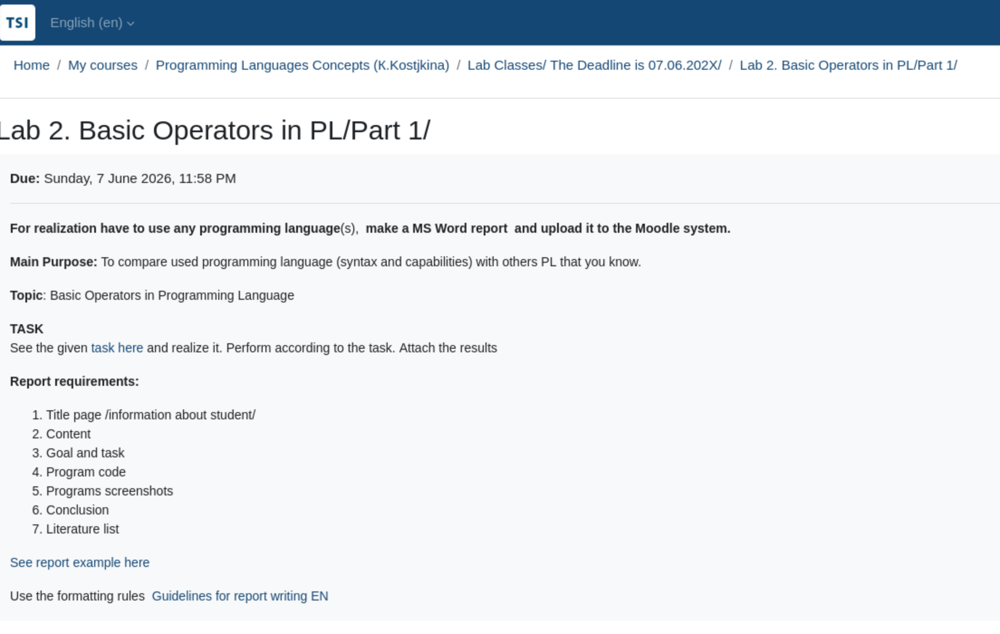

Lab 2. Basic Operators in PL/Part 1/
Completion requirements
Due: Sunday, 7 June 2026, 11:58 PM

For realization have to use any programming language(s),  make a MS Word report  and upload it to the Moodle system. 

Main Purpose: To compare used programming language (syntax and capabilities) with others PL that you know.

Topic: Basic Operators in Programming Language  

TASK
See the given task here and realize it. Perform according to the task. Attach the results

Report requirements:

    Title page /information about student/
    Content
    Goal and task
    Program code
    Programs screenshots
    Conclusion
    Literature list

See report example here 

Use the formatting rules  Guidelines for report writing EN

