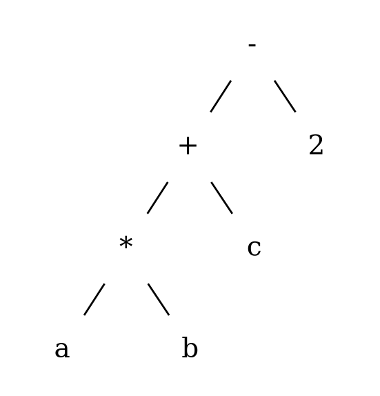
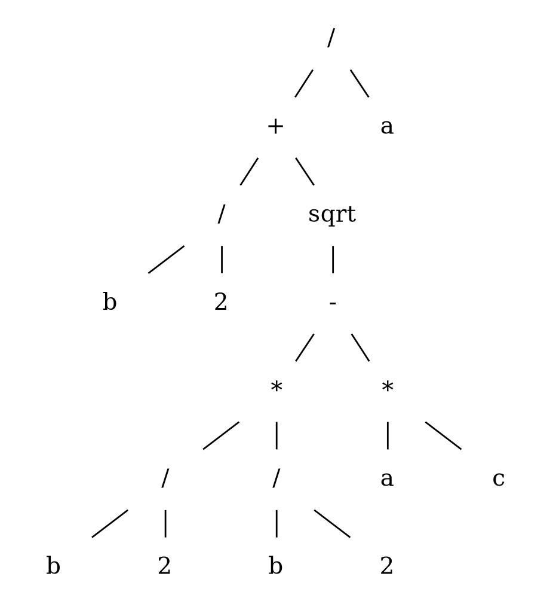
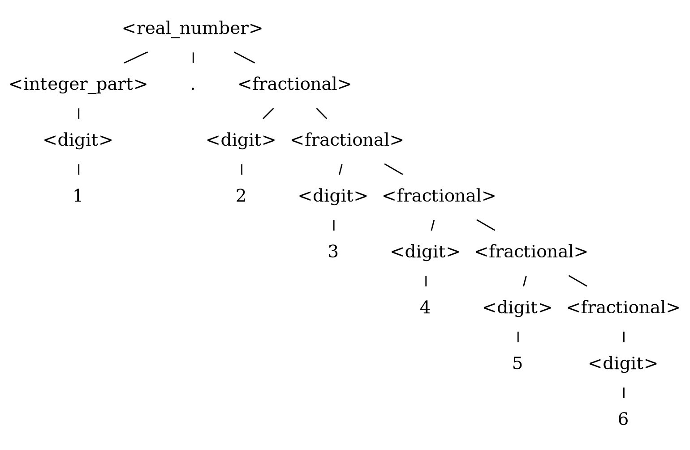
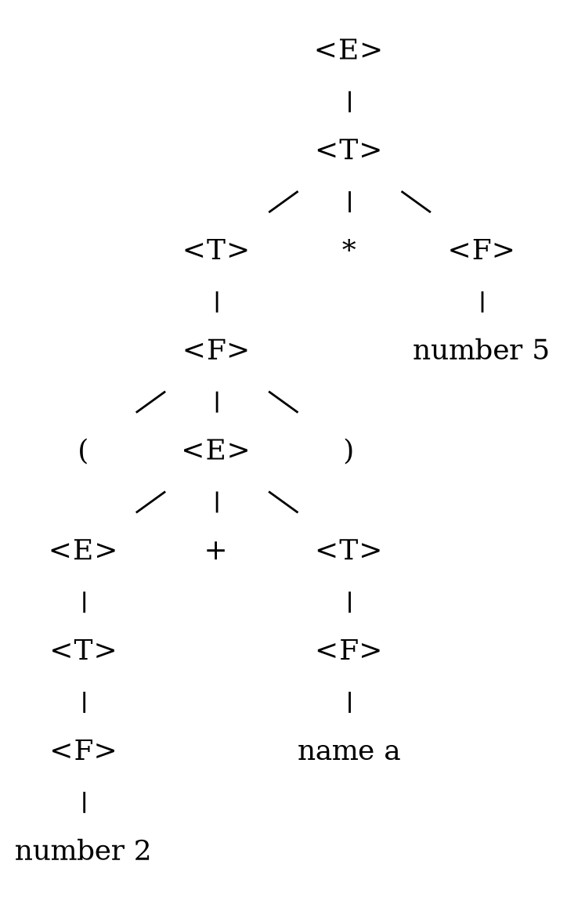
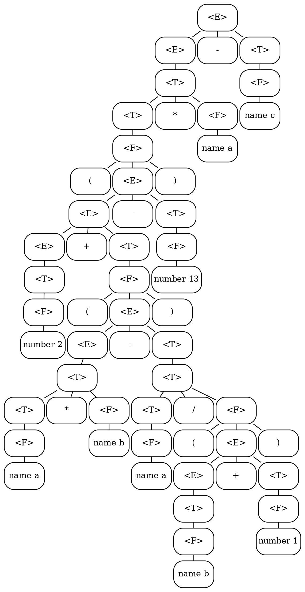
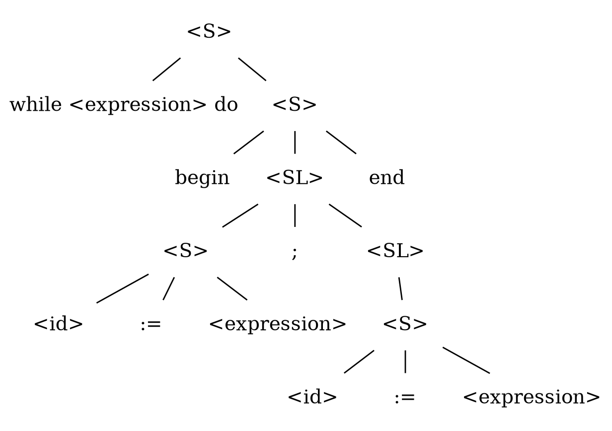

# PLC Control Test No. 1 - Variant 1

Editable diagrams are available in `PLC_CONTROL_TEST_variant_1_trees.drawio`.

## Task 1

Represent expressions in prefix and postfix notations and draw an abstract syntax tree.

### Expression 1

`a * b + c - 2`

- Prefix notation: `- + * a b c 2`
- Postfix notation: `a b * c + 2 -`
- Abstract syntax tree:

{ width=55% }

### Expression 2

`( b / 2 + sqrt ( ( b / 2 ) * ( b / 2 ) - a * c ) ) / a`

- Prefix notation: `/ + / b 2 sqrt - * / b 2 / b 2 * a c a`
- Postfix notation: `b 2 / b 2 / b 2 / * a c * - sqrt + a /`
- Abstract syntax tree:

{ width=75% }

## Task 2

Write a context-free grammar for strings of letters and/or digits that start with a digit.

Note: the table says "0 length or more", but an empty string cannot start with a digit, so the grammar below generates strings of length 1 or more.

```text
<S> ::= <digit> <tail>
<tail> ::= <symbol> <tail> | epsilon
<symbol> ::= <letter> | <digit>
<digit> ::= 0 | 1 | 2 | 3 | 4 | 5 | 6 | 7 | 8 | 9
<letter> ::= A | B | C | ... | Z | a | b | c | ... | z
```

## Task 3

Using the grammar, show a parse tree and a leftmost derivation for string `1.23456`.

```text
<real_number> ::= <integer_part> . <fractional>
<integer_part> ::= <digit> | <integer_part> <digit>
<fractional> ::= <digit> | <digit> <fractional>
<digit> ::= 0 | 1 | 2 | 3 | 4 | 5 | 6 | 7 | 8 | 9
```

### Leftmost derivation

```text
<real_number>
=> <integer_part> . <fractional>
=> <digit> . <fractional>
=> 1 . <fractional>
=> 1 . <digit> <fractional>
=> 1.2 <fractional>
=> 1.2 <digit> <fractional>
=> 1.23 <fractional>
=> 1.23 <digit> <fractional>
=> 1.234 <fractional>
=> 1.234 <digit> <fractional>
=> 1.2345 <fractional>
=> 1.2345 <digit>
=> 1.23456
```

### Parse tree

{ width=70% }

## Task 4

Using the grammar, show a parse tree for the given expressions.

```text
<E> ::= <E> + <T> | <E> - <T> | <T>
<T> ::= <T> * <F> | <T> / <F> | <F>
<F> ::= number | name | ( <E> )
```

### Expression 1

`(2 + a) * 5`

{ width=70% }

### Expression 2

`( 2 + ( a * b - a / ( b + 1 ) ) - 13 ) * a - c`

{ width=100% }

## Task 5

Using the grammar for Pascal language, show a parse tree for the given construction.

```text
<S> ::= <id> := <expression>
      | if <expression> then <S>
      | if <expression> then <S> else <S>
      | while <expression> do <S>
      | begin <SL> end
<SL> ::= <S> | <S> ; <SL>
```

Construction:

```text
while <expression> do begin <id> := <expression>; <id> := <expression> end
```

Parse tree:

{ width=70% }